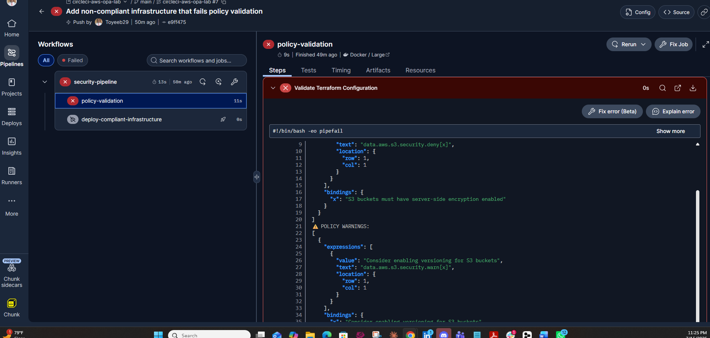
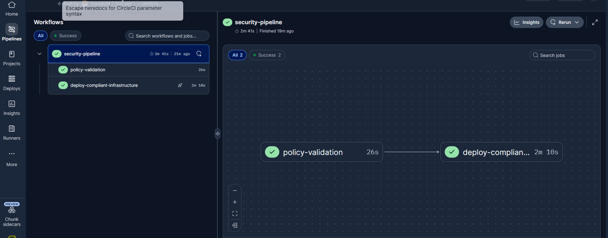

# CircleCI + AWS + OPA Integration Lab

A complete **CI/CD pipeline** built with CircleCI: every push to GitHub automatically triggers a multi-stage workflow that tests, validates, and deploys AWS infrastructure with Terraform — then tears it down. Security gates (OPA policy checks) and keyless OIDC authentication are built into the pipeline stages.

## What This Lab Demonstrates

- **End-to-end CI/CD** — GitHub → CircleCI → AWS: every commit triggers an automated build, validation, and deployment workflow with no manual steps
- **Multi-stage pipeline orchestration** — a `security-pipeline` workflow where the deploy job is gated on a validation job (`requires:`), so failures stop the pipeline early
- **Branch-based workflows** — the same pipeline produces different outcomes per branch (main fails its gate, `compliant-deployment` deploys), demonstrating how CI/CD supports promotion workflows
- **Keyless AWS authentication** — CircleCI assumes an IAM role via OIDC (`AssumeRoleWithWebIdentity`), scoped to this org and project; no long-term AWS keys stored in CI
- **Automated infrastructure deployment** — Terraform runs entirely inside the pipeline: init, plan, apply, output, destroy
- **Quality gates in CI** — OPA policy checks (S3 encryption, no public access) act as one of the pipeline's automated gates, alongside unit tests
- **Automatic cleanup** — resources are destroyed at the end of each run to avoid AWS charges

## Pipeline Behavior

| Branch | Result | Why |
|---|---|---|
| `main` | ❌ Fails (intentionally) | Terraform defines an unencrypted, public-read S3 bucket. OPA detects the violations and the pipeline exits before deployment. |
| `compliant-deployment` | ✅ Passes | Resources meet all policy requirements. OPA validation passes, Terraform deploys the compliant bucket via OIDC, then destroys it. |

The workflow (`security-pipeline`) has two jobs: `policy-validation` runs OPA unit tests and evaluates Terraform resources against the policies; `deploy-compliant-infrastructure` runs only if validation passes.

## Repository Structure

```
circleci-aws-opa-lab/
├── .circleci/
│   └── config.yml                  # Pipeline: policy validation → gated deploy
├── aws-configs/
│   ├── circleci-policy.json        # IAM permissions for the CI role
│   └── circleci-trust-policy.json  # OIDC trust policy (org/project scoped)
├── policies/
│   └── security/
│       └── s3.rego                 # OPA rules: deny unencrypted / public buckets
├── tests/
│   └── s3_test.rego                # Rego unit tests for the policies
├── terraform/
│   └── main.tf                     # Intentionally non-compliant infra (main branch)
├── README.md
└── .gitignore                      # Excludes tfstate, keys, aws-configs
```

## Setup Summary

1. **GitHub** — public repo, connected over SSH (ed25519 key registered in GitHub).
2. **CircleCI** — project connected to the repo; builds trigger on every push.
3. **AWS OIDC** — IAM identity provider for `oidc.circleci.com/org/<ORG_ID>`, plus a `CircleCILabRole` whose trust policy restricts assumption to this CircleCI org and project. `CircleCILabPolicy` grants the minimal S3/IAM/STS actions needed.
4. **CircleCI env var** — `AWS_DEFAULT_REGION` set in Project Settings.

The pipeline exchanges CircleCI's `$CIRCLE_OIDC_TOKEN` for temporary AWS credentials at runtime — no access keys anywhere in the repo or CI settings.

## Troubleshooting Notes (Real Issues Hit During This Lab)

These cost real debugging time — recorded here so the next run is faster.

**1. `Error calling workflow` / `Expected valid identifier` at `<< 'JSON'`**
CircleCI 2.1 configs treat `<<` as pipeline-parameter syntax (`<< pipeline.parameters.x >>`). Bash heredocs inside `run` commands **must be escaped as `\<<`** — CircleCI unescapes them before the shell runs. Removing the backslashes breaks config processing; the escaped form is correct even though it looks wrong and fails if run in a local terminal.

**2. `openpgp: key expired` during `terraform init`**
HashiCorp's release-signing GPG key expired April 18, 2026. Terraform versions older than **1.6.1** embed the old key and cannot verify newly published providers. Fix: bump the Terraform download in `.circleci/config.yml` to 1.6.1 or newer.

**3. Pasting long configs into Git Bash corrupts them**
Multi-hundred-line heredocs pasted into the terminal got mangled (interleaved lines, unterminated heredocs stuck at `>` prompts, stray blank lines). Edit `.circleci/config.yml` in a real editor (VS Code) instead of `cat > file << EOF` for large content.

**4. `git push` rejected: "remote contains work you do not have"**
Happens when the GitHub repo was initialized with files the local repo lacks. Fix: `git pull origin main --rebase --allow-unrelated-histories`, then push.

**5. Paths with spaces**
The parent folder is `GRC ENGINEERING` — quote it in shell commands: `cd ~/Desktop/"GRC ENGINEERING"/circleci-aws-opa-lab`.

## Key Takeaways

- CI/CD turns every push into an automated build-validate-deploy cycle — no manual deployment steps, fully reproducible from config
- Pipeline stages with `requires:` dependencies enforce order: nothing deploys unless upstream gates pass
- OIDC eliminates the biggest CI/CD credential risk — there are no long-lived AWS keys to leak
- Quality gates (tests, policy checks) run minutes after commit, catching problems before they reach AWS
- A failing build can be a *success* — the main branch failing its gate is the pipeline working as designed

## Results

Pipeline runs on both branches (screenshots from the CircleCI dashboard):




- `main`: `policy-validation` fails with "S3 buckets must have server-side encryption enabled" / "must not have public-read ACL" — deploy job never runs
- `compliant-deployment`: both jobs green; logs show OPA validation passing, `terraform apply` deploying the bucket via OIDC, and `terraform destroy` cleaning up

## Cleanup

Terraform resources self-destroy at the end of each successful run. To fully tear down the AWS IAM resources when done with the lab (replace `YOUR_AWS_ACCOUNT_ID` and `YOUR_ORG_ID`):

```bash
# Detach the policy from the role
aws iam detach-role-policy \
  --role-name CircleCILabRole \
  --policy-arn arn:aws:iam::YOUR_AWS_ACCOUNT_ID:policy/CircleCILabPolicy

# Delete the role
aws iam delete-role --role-name CircleCILabRole

# Delete the policy
aws iam delete-policy \
  --policy-arn arn:aws:iam::YOUR_AWS_ACCOUNT_ID:policy/CircleCILabPolicy

# Remove the OIDC identity provider
aws iam delete-open-id-connect-provider \
  --open-id-connect-provider-arn arn:aws:iam::YOUR_AWS_ACCOUNT_ID:oidc-provider/oidc.circleci.com/org/YOUR_ORG_ID
```